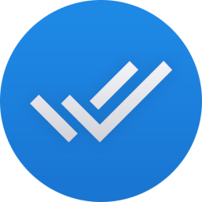

<div align="center">

<h1>ZeppTasks</h1>
<p>Task list for ZeppOS. In sync with Google Tasks or Microsoft To Do</p>
</div>

[](https://mmk.pw/en/zepp/tasks/translate)

- [📀 Homepage & Download](https://mmk.pw/en/zepp/tasks/)
- [❤️ Make a donation](https://mmk.pw/en/donate/)
- [🌎 Help with localization](https://mmk.pw/en/zepp/tasks/translate)

## Build instructions

Required software:
- Python 3.10+
- NodeJS and [ZeppOS CLI Tools](https://docs.zepp.com/docs/guides/tools/cli/)

For sync with Google, you must register in Google Cloud and create a project to obtain OAuth keys.
1. Create new project in Google Cloud console
2. Enable Google Tasks API
3. Create & publish some page that will be able to show obtained token, use it as callback URL
4. Configure OAuth screen, add self as test user, don't forgot to add `tasks` scope
5. Create "OAuth 2.0 Client IDs" in credentials
6. Copy `app-side/Config.js.example` to `app-side/Config.js` and paste your credentials and callback URL into them

For sync with Microsoft you also must create an app at https://entra.microsoft.com and place their credentials to the 
same `app-side/Config.js` file.

Clone this project **recursively**:
```bash
git clone --recursive https://github.com/melianmiko/ZeppOS-Tasks.git
```

Then, you should build assets for all devices. To do that,
run `prepare_all.py` script in that project dir.
```bash
python3 prepare_all.py
```

Now, you'll be able to build project using zeus toolchain.
```bash
zeus preview
```
